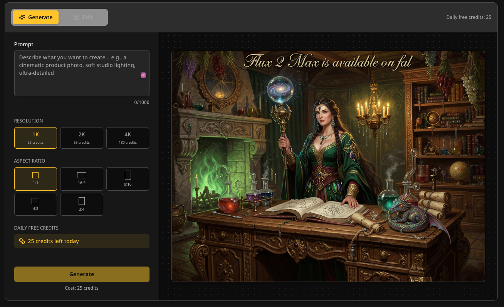
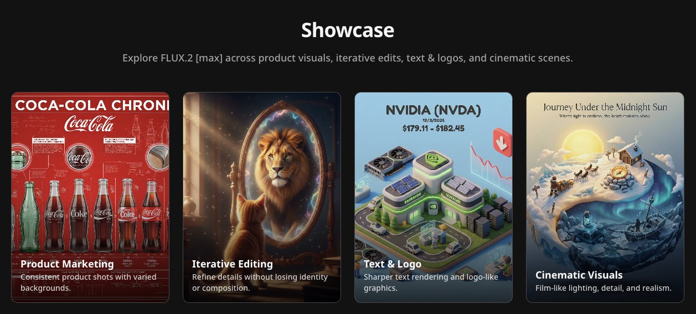

# Flux2Max

  
  <h1>Flux2Max</h1>
  
<strong>Experience Top-Tier Quality with FLUX.2 [max]</strong>

  

    <a href="https://flux2max.pro"><strong>flux2max.pro</strong></a> · 
    <a href="#features">Features</a> · 
    <a href="#how-it-works">How It Works</a>
  

---

## 🚀 Overview

**Flux2Max** is a lightweight, professional-grade playground designed to unleash the full potential of **FLUX.2 [max]** by Black Forest Labs. 

While most interfaces focus solely on generation, Flux2Max provides a complete creative workflow. From initial idea to refined asset, we enable creators to experience the "state-of-the-art" capabilities of FLUX.2: top-tier image quality, precise prompt following, and unprecedented editing consistency.

> **Note**: This is an independent project by [Orvyno](https://github.com/orvyno) and is not affiliated with Black Forest Labs.

## ✨ Key Features

### 🎨 High-Fidelity Generation
Generate stunning images with the **FLUX.2 [max]** model. Experience text rendering, complex composition handling, and photorealistic details that set a new industry standard.

### 🛠️ Iterative Editing
Don't settle for "almost right." Use our **Instruction-Based Editing** to tweak details, adjust lighting, or modify subjects without losing the essence of your original image.

### 🎭 Surface Retexturing
A specialized mode for designers. Keep the geometry and structure of your object but completely swap its material or surface style. Perfect for product visualization and logo design.

### 🆚 Smart Comparison
Stop guessing. Our built-in **Comparison Slider** and **Version History** let you compare your edits side-by-side with the original, ensuring every change improves your work.

### 🌍 Share Your Process
Create beautiful, shareable **Work Pages** that showcase your entire creative journey—from the first prompt to the final polished result.

## 📸 Showcase

### The Workflow
Turn a simple prompt into a polished asset through iteration.

### Quality & Diversity
From cinematic shots to vector-style logos.

## 🛠️ Technology Stack

Flux2Max is built with a modern, high-performance stack:
- **Framework**: [Next.js](https://nextjs.org/) (App Router)
- **AI Integration**: [Vercel AI SDK](https://sdk.vercel.ai/docs)
- **Styling**: Tailwind CSS + Radix UI
- **Database**: PostgreSQL (with Drizzle ORM)
- **Auth**: Better-auth

## 🔗 Try It Out

Ready to create? Visit **[flux2max.pro](https://flux2max.pro)** to start generating.

---

  Created by <a href="https://github.com/orvyno">Orvyno</a>

